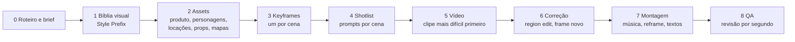

# Framework de vídeo com IA

Tudo o que o JP sabe sobre geração de imagem e vídeo com IA, num lugar só: Higgsfield (web e CLI), Seedance 2.0 e 2.5, Seedream, Dreamina, ChatGPT imagem e o método da Human Academy.

Este documento é vivo. Quando entrar material novo (aula, teste, post, projeto), ele vai para `fontes/` e o aprendizado vem para cá, na seção certa.

> Última atualização: 2026-09-26 (dados da CLI conferidos na conta) · fontes na [seção 17](#17-fontes)

## Sumário

1. [As leis em uma tela](#1-as-leis-em-uma-tela)
2. [O ecossistema: ferramentas e modelos](#2-o-ecossistema-ferramentas-e-modelos)
3. [O pipeline de produção](#3-o-pipeline-de-produção)
4. [Assets: travar tudo antes de a câmera andar](#4-assets-travar-tudo-antes-de-a-câmera-andar)
5. [Anatomia do prompt de imagem](#5-anatomia-do-prompt-de-imagem)
6. [Anatomia do prompt de vídeo](#6-anatomia-do-prompt-de-vídeo)
7. [Vocabulário de câmera, luz e cor](#7-vocabulário-de-câmera-luz-e-cor)
8. [Tempo, ritmo e montagem](#8-tempo-ritmo-e-montagem)
9. [Som](#9-som)
10. [Ferramentas na prática](#10-ferramentas-na-prática)
11. [O método Human Academy, lido prompt a prompt](#11-o-método-human-academy-lido-prompt-a-prompt)
12. [Economia de crédito e checklist antes de gerar](#12-economia-de-crédito-e-checklist-antes-de-gerar)
13. [Diagnóstico: sintoma, causa, correção](#13-diagnóstico-sintoma-causa-correção)
14. [Casos reais do JP](#14-casos-reais-do-jp)
15. [Glossário](#15-glossário)
16. [Em aberto (a validar)](#16-em-aberto-a-validar)
17. [Fontes](#17-fontes)

---

## 1. As leis em uma tela

Se só der tempo de ler uma seção, é esta. Cada lei tem a origem entre parênteses.

1. **O frame manda, o prompt só sugere.** O modelo de vídeo copia com fidelidade o que está na imagem de partida. O que não está nela, ele inventa. Detalhe que não pode errar vai para a imagem, não para o texto. (Dreamina/BORA)
2. **Trave os assets antes de mover a câmera.** Produto, personagem, locação e objetos de cena são gerados primeiro, como imagens de referência, e reaproveitados em todas as cenas. É isso que segura a consistência. (Higgsfield)
3. **Referência vence descrição.** Um rosto ou produto travado por imagem sobrevive a cortes, mudança de luz e movimento de câmera. Texto sozinho deriva. (Guia Seedance 2.5)
4. **Um rosto por referência.** Folha de personagem com vários rostos faz o vídeo "derivar". Apague os rostos duplicados e deixe um só para o modelo travar. (Higgsfield)
5. **Mudou o estado, gera outra folha.** Personagem seco no começo e suado no fim? São duas referências com nomes diferentes (`@hero` e `@hero_wet`). (Higgsfield)
6. **Posição não se segura com texto. Use um mapa.** Um esquema visto de cima, marcando onde fica cada coisa, mantém tamanho e posição take após take. (Higgsfield)
7. **Diga o que NÃO acontece.** "No music", "no cuts, no zoom", "no 3D, no cartoon, no VFX", "nobody stands". As proibições evitam mais erro do que descrição positiva a mais. (Guias Seedance)
8. **Plano a plano vence parágrafo corrido.** Numere os cortes (Shot 1, Shot 2 ou CUT 1, CUT 2), cada um com enquadramento, lente, movimento e ação, e feche com "Hard cut". Transição vaga é a causa número 1 de sequência que desmonta. (Guia Seedance 2.5)
9. **Número, não adjetivo.** "Sensor de 8 cm", "mão a 5 cm", "spray a 12% da altura do quadro", "névoa com densidade de 15%, visível a 15 metros", "29° de campo de visão", "aos 5,4 s ela fala". O modelo obedece medida muito melhor que "pequeno" ou "perto". (BORA, Higgsfield)
10. **Imagem é barata, vídeo é caro.** Itere no frame até ele estar certo. Só depois gaste crédito de vídeo. (Dreamina/BORA)
11. **Comece pelo clipe mais difícil.** Se ele funcionar, o método está validado para o resto. (Dreamina/BORA)
12. **Direção de verdade, não resumo.** Nada de "ela fica triste" ou "ele dança". Escreva o gesto: "os olhos caem para a mesa, o maxilar trava, ela engole uma vez". Dança é escrita passo a passo, senão sai um balançar genérico. (Skill shotlist, Higgsfield)
13. **Editorial de moda, não "cinematic" genérico.** Toda imagem começa por uma decisão forte: ângulo extremo, luz dura e real, styling com paleta desenhada em volta do produto, algo em primeiro plano cortado pela borda. Bar à meia-luz com lâmpada de filamento, plano médio centralizado e brilho de propaganda são a cara da IA. (Human Academy, [11.4](#114-o-que-os-resultados-do-curso-fazem-e-a-primeira-heineken-não-fez))
14. **Não embeleze.** "Do not automatically brighten, beautify or restyle the scene." Distorção de lente, sombra dura, grão e fundo imperfeito fazem parecer foto de verdade. No vídeo, deixe a referência carregar o look em vez de descrevê-lo. (Human Academy, [11.5](#115-prompt-de-cobertura-de-vídeo-a-outra-metade-do-método))
15. **Marca nunca é gerada.** Rótulo, logo e tampinha vêm de **foto real do produto colada por código** (stills) ou de tracking na pós (vídeo). Nem a folha de produto "fiel" do GPT serve: ela interpreta a tipografia. Modelo de imagem e de vídeo embaralha letra de marca, principalmente em objeto pequeno e em movimento. (Heineken, [14.5](#145-heineken-ultimate-com-o-jp-set2026-em-andamento))
16. **Movimento se ensaia antes, em argila.** Com o still herói aprovado, o filme é montado em 3D simples no Blender (medidas reais, câmera com massa, física, tempo de cada plano) e vira um vídeo de argila que entra no Seedance como referência de movimento, junto com o still. Ajustar câmera e tempo no previs custa zero crédito. (Human Academy, [11.6](#116-previs-no-blender-hero-frame--argila--seedance))

---

## 2. O ecossistema: ferramentas e modelos

### 2.1 Quem é quem

- **Higgsfield**: plataforma que reúne mais de 40 modelos de imagem, vídeo, 3D e áudio (dela e de terceiros), com interface web e uma **CLI** (interface de linha de comando, usada no terminal ou pelo Claude Code). É onde estão o Seedance 2.5, o Cinema Studio e o Soul.
- **ByteDance** (dona do TikTok e do CapCut) faz a família **Seed**: **Seedance** (vídeo), **Seedream** (imagem) e **Seed Audio** (voz). O **Dreamina** é o app da própria ByteDance para usar esses modelos.
- **ChatGPT (GPT Image)**: ótimo para frames com referência real, folhas de produto, edições e mapas. No Higgsfield aparece como GPT Image 2 e 2.5.
- **Claude + skill de shotlist**: transforma roteiro em shotlist com prompts prontos no formato que o Seedance espera (ver [10.5](#105-claude-com-a-skill-de-shotlist)).

### 2.2 Modelos de imagem (para assets e frames)

| Modelo (nome na CLI) | Melhor uso | Limites úteis |
|---|---|---|
| GPT Image 2.5 (`gpt_image_2_5`) | Padrão recomendado pela Higgsfield. Folha de produto, edição, mapa esquemático, texto na imagem. **Melhor modelo para stills no estilo editorial do curso com pessoa real** (teste de 2026-09-26, seção 14.5) | `--quality high`, `--resolution 2k` |
| GPT Image 2 (`gpt_image_2`) | O que a Higgsfield usou para folhas de produto, edições e mapas no tutorial dos fones | |
| Soul Cinematic (`soul_cinematic`) e Soul V2 (`text2image_soul_v2`) | Personagem fotorreal ("Soul Cinema"). Aceita **Soul ID** (rosto treinado) | 1 referência só, 1.5k ou 2k |
| Soul Location (`soul_location`) | Locação fotorreal ("Cinematic Locations") | Aceita 21:9 e 9:21 |
| Cinematic Studio 2.5 (`cinematic_studio_2_5`) | Still de cinema com muitas referências | Até 14 referências, 1k/2k/4k, aceita 21:9 |
| Seedream 4.5 (`seedream_v4_5`) | Frames em série com referências | Até 14 referências, aceita 21:9 |
| Seedream 5.0 Lite (`seedream_v5_lite`) | O "Seedream 5.0" que o curso usa. Raciocina e pode buscar na web antes de gerar | 1:1, 4:3, 3:4, 16:9, 9:16 e 21:9. `--quality basic` ou `high` (o "2K" do curso é o `high`). 1 crédito por imagem |
| **Seedream 5.0 Pro** (`seedream_v5_pro`) | Folha de personagem a partir de fotos reais, edição de folha (apagar rosto, trocar roupa) | Até 10 referências, `--resolution 1k/1.5k/2k` (sem `--quality`), aceita 21:9. 2,5 créditos em 2K, 1,25 em 1K |
| Seedream 5.0 Flash (`seedream_5_0_flash`) | Versão rápida do Seedream 5 | |
| Nano Banana Pro (`nano_banana_2`) | Geração e edição em 2k | |
| Flux Kontext (`flux_kontext`) | Edição por instrução ("troque a cor da camisa") | |
| Outpaint (`outpaint`) | Estender uma imagem para os lados (vira ultra wide) | |

### 2.3 Modelos de vídeo

| Modelo (nome na CLI) | Duração | Referências | Destaques |
|---|---|---|---|
| **Seedance 2.5** (`seedance_2_5`) | até **30 s** | até **50** (imagem, vídeo e áudio) | Vários planos numa geração só, 1080p nativo, proporções de 9:16 a 21:9, áudio (ambiente, foley e trilha) no mesmo passe, **region edit** (corrige só um pedaço sem refazer o clipe). Até 30 imagens dentro das 50 referências. Modos: `t2v`, `omni_reference`, `video_edit`, `video_extension` (ver [10.2](#102-higgsfield-cli)). É o padrão atual da Higgsfield para vídeo |
| **Seedance 2.0** (`seedance_2_0`) | até 15 s (a skill mira 15 s) | até 9 imagens + 3 vídeos + 3 áudios, 12 no total | 480p a 4K, `--genre`, áudio nativo. Modo `fast` só vai até 720p |
| Seedance 2.0 Mini | curto | igual ao 2.0 | Mais barato, até 720p |
| Cinematic Studio Video 3.5 (`cinematic_studio_video_3_5`) | 15 s padrão | até 15 | Presets de estilo (câmera, luz, cor) e multi-shot por parâmetro (ver [7.5](#75-presets-do-cinematic-studio-35)) |
| Cinematic Studio 3.0 | 5 s padrão | até 15 | Speed ramp (`slowmo`, `impact`...), até 4K |
| Kling 3.0, Veo 3.1, Wan 2.7, Hailuo, Grok Video | variam | variam | Alternativas. Rodar `higgsfield model get <nome>` para ver os parâmetros |

### 2.4 Áudio e utilidades

- **Seed Audio** (`seed_audio`): narração e voz. **Sonilo Music** (`sonilo_music`): trilha. **Mirelo** (`mirelo_text_to_audio`): efeito sonoro a partir de texto.
- **Reframe**: muda a proporção de um vídeo pronto (ex.: 16:9 para 9:16).
- **Dubbing** e **Voice change**: dublagem e troca de voz.
- **Draw to Video**: edita um vídeo a partir de um frame rabiscado ("make the jacket red" no segundo 3,2).
- **Video Background Remover**: tira o fundo do vídeo.
- **Virality Predictor** (`brain_activity`): analisa um vídeo pronto e dá nota de gancho, atenção, retenção e potencial viral.

---

## 3. O pipeline de produção

O mesmo esqueleto aparece no tutorial da Higgsfield, no comercial do BORA e no curso da Human Academy.



| Etapa | O que sai | Ferramenta típica |
|---|---|---|
| 0. Roteiro e brief | Logline, batidas da história, duração total, proporção, onde vai rodar | Claude, papel |
| 1. Bíblia visual | O **Style Prefix**: gênero, look, luz, paleta 60:30:10, câmera, som | Claude (skill) |
| 2. Assets | Folha de produto, folha de personagem, locações em 3/4, props, mapas. Cada um com nome único | GPT Image, Soul, Seedream |
| 3. Keyframes | Um frame por cena, no ângulo do primeiro corte, um instante antes da ação | Seedream, ChatGPT, Cinematic Studio |
| 4. Shotlist | Prompts numerados (1a, 1b, 2a...), cada um com prefixo, personagens, cena e cortes | Claude + skill |
| 5. Vídeo | Clipes de 15 s (2.0) ou até 30 s (2.5) | Seedance |
| 6. Correção | Só o trecho errado: region edit, draw to video ou frame novo | Higgsfield |
| 7. Montagem | Música, cortes finais, textos e telas por cima, versões 9:16 e 4:5 | Editor, Reframe |
| 8. QA | Revisão segundo a segundo, nota de viralidade | Olho, Virality Predictor |

---

## 4. Assets: travar tudo antes de a câmera andar

### 4.1 Regras gerais

- **Fundo cinza liso e neutro** em folhas de personagem, produto e prop. Nada compete com o elemento, e a taxa de acerto sobe.
- **Locação em 3/4**, nunca de frente chapada. O ângulo de três quartos dá profundidade para a câmera se mover dentro do espaço.
- **Uma referência por elemento** que precisa ficar igual (rosto, produto, locação, estilo). Um conjunto pequeno e escolhido vence um conjunto lotado. O teto de 50 do Seedance 2.5 não é meta.
- **Nome único e igual em todo lugar**: no arquivo, no Elements do Higgsfield e no prompt. Ver [4.7](#47-nomes-e-tags).
- **Referência real antes de tudo.** Fotografe ou recorte o objeto real. No BORA, descrever o cartão do metrô só em texto gerou um cartão de crédito.
- **Tire logos e textos reais.** Peça "all text soft and unreadable", "no brand logos". Marca real aparecendo (ou falhando) num comercial dá problema.

### 4.2 Folha de produto

- Parte de **uma foto real**. Prompt da Higgsfield: `Make a product sheet with front and 3/4 perspective views of the headphones from @image_1.`
- Valida que o produto sai certo antes de ir para qualquer cena (o "packshot" do BORA).
- No texto, só o que a imagem não mostra: **escala** ("sensor de cerca de 8 cm, embutido e rente ao tampo") e **orientação** ("face do sensor nivelada, paralela ao chão").

### 4.3 Folha de personagem (character sheet)

Existem dois modelos, e eles servem a coisas diferentes.

**Modelo Higgsfield (para travar no vídeo)**: split-frame em dois painéis.

- Esquerda: close do rosto, **cabeça inteira no quadro com todo o cabelo, nada cortado**, olhando para a lente, lente de 85 mm.
- Direita: corpo inteiro de frente e de costas, lado a lado, braços soltos, mesma escala e luz, lente de 35 mm. Altura em número ("1,85 m").
- Fundo cinza liso, divisórias verticais, luz difusa.
- Depois, **apague o rosto do corpo inteiro**: `Erase the face from the full-body shot on the right panel.` Assim sobra um rosto só para o modelo travar.

**Modelo Human Academy (bíblia de pré-produção)**: uma prancha completa.

- Quatro vistas: frente, 3/4, perfil, costas.
- Expressões **tiradas do roteiro** (no curso: neutra, assustada, ofegante, determinada).
- Detalhes do figurino e acessórios em insert.
- Serve para gerar keyframes e para o time inteiro enxergar o personagem. Para o vídeo, recorte o painel de rosto e o de corpo inteiro em arquivos separados, seguindo a lei do rosto único.

Prompt completo pronto: [exemplos/character-sheet-street-girl.md](exemplos/character-sheet-street-girl.md).

**Formato padrão do JP (o que usamos para personagem real):** junta os dois modelos.

- **Fileira de cima, cabeça em 4 ângulos:** frente, 3/4, perfil, nuca. Expressão neutra, boca fechada, 85 mm, com espaço acima do cabelo. É a única fileira com rosto.
- **Fileira de baixo, corpo em 4 ângulos sem cabeça:** frente, 3/4, perfil, costas.
- **Nunca peça para o modelo "cortar no pescoço".** Ele espreme o corpo para caber (tronco curto, braço comprido) e o vídeo copia a proporção errada. O certo: gerar os corpos inteiros, com cabeça e proporção descrita em número ("about 7.5 heads tall, fingertips at mid-thigh"), e **tirar a cabeça por código** (pintar acima do pescoço com o cinza do fundo). Nenhum modelo toca nessa etapa, então não há alucinação.
- Referências: fotos reais só para o rosto (a frontal neutra tipo documento é a mais forte; a de perfil segura o nariz e o maxilar) e a folha anterior "ONLY for the outfit".
- Prompts e script em `Downloads/character-sheet-jp/` (`prompt_sheet_v2.txt`, `prompt_bodies_v3.txt`).

**Variações:**

- **Figurino novo**: edite a folha existente, mantendo rosto e identidade. `Edit this character sheet so he's wearing a blue athletic outfit, with these sneakers (@sneakers).`
- **Juntar looks**: dá para combinar peças de várias imagens ("the shirt from Image 2 recolored to pastel pink, the jeans and Converse from Image 1").
- **Estado físico** (suado, molhado, sujo, ferido): folha nova com nome novo. `same character sheet, post-run, sweaty chest, sweat stains on the shirt.` → `@s_hero_wet`.
- **Rosto real e recorrente**: treine um **Soul ID** com 3 ou mais fotos e use em qualquer modelo Soul (ver [10.2](#102-higgsfield-cli)).
- **Personagem secundário** pode ser simples: `An office boss in his 50s with a pot belly, wearing a suit.`

### 4.4 Locações

- **3/4 para profundidade**: `Modern apartment kitchen, 3/4 angle, bright clean daylight, high-end commercial look.`
- Para locação que carrega a cena, escreva em **blocos**, como o estádio do tutorial dos fones:
  `THE FOREGROUND & ROOF` · `THE TRACK` · `THE FIELD` · `THE BACKDROP` · `THE LIGHT & SKY` · `COLOR GRADE` · `CAMERA & LENS` · fecho com "photorealistic, 16:9, no on-screen text, no visible brand logos, no crowd".
- **Luz coerente com o lugar**: metrô subterrâneo tem só fluorescente fria. Sem essa frase, saiu com sol.
- **Versão A e versão B** (problema e solução) com a mesma câmera e a mesma arquitetura, quando o filme compara antes e depois.
- **Ultra wide** para establishing (estabelecer escala). Prompt completo: [exemplos/cidade-engolida-ultrawide.md](exemplos/cidade-engolida-ultrawide.md). Seedream 5.0 Lite, Soul Location, Cinematic Studio 2.5 e Seedream 4.5 aceitam 21:9. Para panorama ainda mais largo, estenda com Outpaint.

### 4.5 Objetos de cena (props)

- **Objeto que aparece de vários ângulos**: folha ortográfica ("turnaround") com lateral, medial, topo, 3/4, traseira e sola, fundo cinza, escala igual e sombra de contato.
- **Objeto simples**: uma frase basta. `A ceramic mug with a reddish-orange pinstripe around the rim. Clean studio light, neutral background, centered, product photography.`
- **Negative prompt** ajuda em objeto com detalhe: `brand logos, watermark, hand, cluttered background, distorted letters, oversized patches...`
- **Objeto original**: "STRICTLY NO branding... fully original and unbranded" evita que o modelo copie tênis de marca real.
- No prompt de vídeo, reforce: `MUG (@mug_cream): ... 100% matches the reference.`

### 4.6 Mapas esquemáticos

> "Texto não segura uma posição. Um mapa segura." (Higgsfield)

- Gere uma **planta vista de cima** que marca onde fica cada coisa e o tamanho relativo. Prompt do tutorial: `make a schematic - mark the fire hydrant, and lock the skydancer to its right, it should be two times a person's height, located on the same line.`
- Suba o mapa como referência (`@street_schematic`) e cite no prompt: `Location reference: @street_schematic. @skydancer POSITION LOCKED: on the sidewalk immediately to the right of the fire hydrant.`
- No BORA, o **mapa de layout** segurou posição das catracas, filas e câmera.

### 4.7 Nomes e tags

| Onde | Como a tag funciona |
|---|---|
| Higgsfield | Cada asset vai em **Elements** com o nome exato usado no prompt (`@hero`, `@headphones`). Nome igual = a imagem certa é anexada sozinha na geração |
| Dreamina | A tag é o **nome do arquivo sem extensão** (`@f2a_cartao`, `@luana`). Não é `@Image1`. Confira depois do upload: se o Dreamina renomear, troque no prompt |
| CLI | Arquivos entram por `--image`, `--start-image` etc. No texto, cite pela ordem ("the woman from Image 1") ou pelo nome |

Regras: nome curto, único e descritivo. Frame novo ganha nome novo (`f2a_cartao`), nunca sobrescreve o antigo. Dois arquivos chamados `f2a` viram tag ambígua.

---

## 5. Anatomia do prompt de imagem

### 5.1 Dissecando o keyframe do curso

O prompt do portão tomado por plantas (em [fontes/human-academy-curso.md](fontes/human-academy-curso.md)) é um modelo de still cinematográfico. Ele empilha sete camadas, sempre nesta ordem:

| Camada | Trecho do prompt | Por que funciona |
|---|---|---|
| 1. Plano e tipo de imagem | `Extreme low-angle worm's-eye shot, cinematic editorial photograph.` | A primeira frase define a câmera e o gênero da foto. O resto obedece |
| 2. Personagem | `A young East Asian woman with very long straight jet-black hair...` | Etnia, idade, cabelo com comprimento, textura e cor |
| 3. Posição no espaço | `stands in the open doorway of a white-painted brick gatehouse with tall black ornate wrought-iron gates swung open` | Onde ela está em relação à arquitetura |
| 4. Figurino peça a peça | `slouchy heather-grey knit beanie, black sleeveless fitted tank top with a twisted knot detail at the chest, oversized black cargo bermuda shorts...` | Cada peça com cor, material, modelagem e detalhe. É isso que o modelo repete entre imagens |
| 5. Estado emocional pelo corpo | `Her lips are parted, eyes glancing sideways off-frame, alert, sensing danger.` | Emoção descrita em boca e olhar, não em adjetivo solto |
| 6. Ambiente como personagem | `Vegetation completely dominates the scene: massive dense ivy... Roots crack the white bricks... foreground leaves out of focus framing the lens. Lush, overwhelming, alive, slightly menacing overgrowth.` | Espécies reais (monstera, bananeira, samambaia), ação física (rachar, envolver, pender) e primeiro plano desfocado dando profundidade |
| 7. Luz, lente, filme e formato | `Late-afternoon backlight..., warm rim light on her hair, green bounce light on skin, soft haze. Shot on 24mm wide lens, shallow depth of field..., Kodak Portra 400 film grain, rich deep greens against black and white, high detail, 16:9.` | Hora do dia, direção da luz, luz rebatida pelo ambiente (o verde na pele), névoa, lente, profundidade de campo, filme fotográfico, paleta e proporção |

**Detalhe que ensina:** "green bounce light on skin". A luz rebatida pelo verde das folhas tinge a pele. É o tipo de física de luz que deixa a imagem crível.

**Atenção ao relógio:** o roteiro do curso começa numa "manhã clara", mas esse keyframe usa luz de fim de tarde. Numa sequência, a luz é o relógio do filme: manhã, meio-dia, fim de tarde e pôr do sol precisam seguir a história (ver [exemplos/selva-urbana-20-frames.md](exemplos/selva-urbana-20-frames.md)).

### 5.2 Template

```
[PLANO + ÂNGULO], [tipo de imagem: cinematic editorial photograph / film still / product shot].
[PERSONAGEM: idade, etnia, corpo, cabelo] [POSIÇÃO no espaço, em relação à arquitetura e aos outros].
She/He wears [peça 1 com cor, material e modelagem], [peça 2], [calçado], [bolsa/acessórios].
[ESTADO: boca, olhar, postura, respiração].
[AMBIENTE: o que domina, materiais, ação física, primeiro plano].
[LUZ: hora, fonte, direção, rim, bounce, névoa]. Shot on [lente], [profundidade de campo], [filme/grão], [paleta], [detalhe], [proporção].
[PROIBIÇÕES: no text, no logos, no extra people...]
```

### 5.3 Regras para frames que vão virar vídeo

- **Ângulo do primeiro corte.** Se o corte 1 é um insert de 85 mm, o frame é um insert de 85 mm. Frame e corte batendo = o vídeo começa pronto.
- **Um instante antes da ação.** Cartão a poucos centímetros do leitor, tela ainda azul. A mudança acontece no vídeo.
- **Um frame por detalhe crítico.** Se o que importa é o cartão encostando na seta do validador, o frame é esse plano fechado. A pessoa entra depois pela referência.
- **Respiro em cima e embaixo** (pelo menos ~150 px no 4:5) quando a peça vai ser recortada em 4:5, 1:1 e story.
- **Telas e textos ficam desfocados de propósito.** Tela de celular sai ilegível e a interface real entra na edição, por cima (caso de um anúncio de app). Reserve área livre para marca e preço.
- **Exceção que funcionou: tela grande de produto como referência** (totem BORA, set/2026). No Seedream 5 Pro, com o PNG da interface como última referência e o texto dela citado entre aspas no prompt, a tela saiu legível e fiel, com tipografia grossa e poucas palavras. Pacote de referências usado: locação aprovada, product sheet, foto do produto, character sheet, dois rostos, **esquema de perfil em escala** (balcão, totem, pessoa, distância da mão e do celular em cm, gerado por código) e a tela. O esquema resolveu a mão e o celular "retos para o sensor", que por texto e por edição da locação saíam errados. A composição por código continua como plano B se o texto derivar no vídeo.

---

## 6. Anatomia do prompt de vídeo

### 6.1 O que vale para qualquer versão

- **Prompts de vídeo em inglês**, mesmo quando a conversa é em português.
- **Declare a estrutura no topo**: número de planos, duração total e proporção. Ex.: `Total: 15s / 6 shots / 16:9`.
- **Uma regra visual no topo, uma regra de som no fim, planos no meio.**
- **Geografia explícita**: quem está onde, virado para onde, a que distância. "Doze pés entre eles." "Ela sempre à ESQUERDA dele. Eles nunca trocam de lado."
- **Direção de movimento**: todo mundo entra na estação, rumo às escadas; nas vistas laterais, a entrada fica à esquerda do quadro.
- **Continuidade no texto, não em bloco separado**: cabelo molhado da cena 3, sangue no nó do dedo da cena 5, mesmo figurino, a menos que tenha trocado em cena.
- **Movimento desde o primeiro frame**: "Every person moving from frame one." Personagem parado vira estátua.

### 6.2 Formato Seedance 2.0 (skill de shotlist, clipes de 15 s)

Ordem fixa, de cima para baixo:

```
[STYLE PREFIX, bloco inteiro]

Characters:
[Âncoras curtas e específicas, só de quem está neste prompt, carregando o estado das cenas anteriores.]

Scene:
[1 a 2 frases. O que acontece, onde, quando. Posição de cada personagem no espaço.]

CUT 1 - [tipo de plano, lente, movimento]:
[Batida de atuação, gesto, olhar, respiração, micro-pausa. O que a câmera faz. O que a luz faz. Som diegético.]

CUT 2 - [tipo de plano, lente, movimento]:
[...]

CUT 3 - [tipo de plano, lente, movimento]:
[Batida final dos 15 segundos.]
```

- **Cada prompt mira 15 s.** Escreva batidas suficientes para encher os 15 s, sem ar morto no fim. Normalmente 1 a 3 cortes; 4 ou mais se for ação.
- **Cena longa vira 3a, 3b, 3c**, cada uma com prefixo e personagens completos.
- **Ritmo dramático, não eficiente.** Confissão precisa de ar: divida. Fala pesada ganha um prompt só dela. Revelação cai num close sustentado, sem cortes a mais.
- **Contenção por padrão.** Um sussurro vence um grito em 90% dos casos.
- **Câmera com motivo.** "Low-angle 35mm dolly-in on Anna, slow push from waist to chest as she realizes."
- No Dreamina, **limite de 4.000 caracteres**: use prefixo curto (~700 caracteres) e deixe a imagem carregar o resto.

Exemplo real (anúncio de um produto digital, cena 1a), resumido:

```
Characters:
BIA: Brazilian woman, 29, warm olive skin, wavy dark-brown hair in a loose low bun with strands
falling by the left ear, thin gold hoop earrings, oversized cream cable-knit sweater...

Scene:
A small São Paulo apartment kitchen at night. Bia sits alone at a light-wood table pushed against
the wall, facing camera-left... The only window is behind her, city lights and blue night haze
outside, backlighting her hair.

CUT 1 - Wide static, 35mm, eye-level, locked off from the doorway:
Bia sits hunched over the papers, left elbow on the table, fingers pressed into her temple. The phone
vibrates against the wood, a short buzz, then another. She doesn't move for a beat...
```

### 6.3 Formato Seedance 2.5 (seções rotuladas, até 30 s)

Um bloco contínuo, dividido em seções com rótulo. Pular uma seção faz o resultado falhar de um jeito previsível.

| Seção | O que vai nela |
|---|---|
| `GLOBAL STYLE` | Gênero, grade de cor, filme ou digital, proporção, obturador e **o que não pode aparecer** |
| `SCENE` | Uma linha: o que acontece, onde, com que clima |
| `CHARACTERS` | Rosto, cabelo, corpo e figurino de cada um. Se há referência, basta dizer qual é qual |
| `LOCATION` | Espaço e objetos, separado das pessoas. Locação vaga é a causa mais comum de deriva entre cortes |
| `FIRST FRAME AND BLOCKING` | Posição exata de todos no início: quem, onde, virado para onde. Pode usar coordenadas ("x 42%, head at y 44%") |
| `Shot 1`, `Shot 2`... | Tipo de plano e ação em uma ou duas frases, terminando em `Hard cut.` O ritmo nasce aqui |
| `OPTICS` e `CAMERA` | Lente (em mm ou em graus de campo de visão), altura, movimento por plano |
| `PHYSICS` | Como tecido, fumaça, cabelo, líquido, papel se movem |
| `LIGHTING` | Fonte motivada, direção, como cai no rosto |
| `AUDIO` | Ambiente, efeitos e o que não pode ter ("No music, no discernible dialogue") |

**Blocos avançados que aparecem nos prompts testados pela Higgsfield:**

- `FORMAT MODE`: "Controlled five-segment sequence, four HARD CUTs, 15.0 seconds total. Real-time motion."
- `ACTION TIMING`: cada segmento com início e fim em segundos e a fala no segundo exato. `3.0s to 7.2s, SEGMENT 2, her close-up. At 5.4s she says, soft and unsteady: "I will always love you." HARD CUT.`
- `EVENT TRACK`: trilha de eventos do ambiente com horário e intensidade. `1.2s, WAVE 1 strikes the forward boulders, bursting spray to 12 percent of frame height.` Faz o mar (ou a multidão, ou o vento) parecer vivo e não textura repetida.
- `STILLNESS LOCK`: o que fica parado. "Both remain seated for the entire video. Nobody stands, nobody hugs."
- `POSITIVE LOCKS`: a lista do que não muda. "The backpack strap stays on one shoulder only. The boss stands beside his desk in every cut."
- `LENS LOCK`: uma lente por segmento. "Segments 1, 5 at 47°. Segments 2, 3 at 29°."
- **Trava de elenco**: "exactly four, never five, never duplicated" (impede um figurante virar membro extra da banda).
- **Regra única de efeito**: transforme o efeito mágico numa lei física repetível. "Each color wave radiates from the exact footfall point at constant speed, repainting and staying."
- **Dois sistemas de qualidade**: `[FILM]` limpo como padrão e `[REPORTER CAM]` degradado só para planos de celular ou helicóptero.
- **Referências "in spirit"**: citar filmes e diretores de fotografia como norte ("Tenet for practical altitude weight, Sicario for cold procedural tension"), sempre com "fully original execution".
- **Bloco de textura anti-plástico**: grão 35 mm, gate weave, halation, aberração cromática leve nas bordas, respiração de foco, "NOT 3D-render, NOT plastic CGI sheen".
- **Material descrito como física**: dinheiro não é "bloco", é "individual banknotes... each tumbling on its own air current". Vale para papel, tecido, folha, água.

O que os testes da Higgsfield mostraram:

- Referência segura identidade melhor que texto.
- **Gênero e luz fazem mais que o texto.** Trocar só o gênero muda ritmo, contraste e câmera, com a mesma cena escrita.
- Cena com muitos rostos é a mais difícil. Quanto mais rostos no plano, mais referência cada um precisa.
- `GLOBAL STYLE` e `AUDIO` funcionam como guarda-corpo. Excluir o que não deve aparecer evita mais falha do que descrever mais.

Template pronto e um exemplo completo de 30 s: [exemplos/maca-verde-fashion-film-seedance25.md](exemplos/maca-verde-fashion-film-seedance25.md).

### 6.4 Formato curto dos virais (Seedance 2.0)

Para transformações, POVs, lutas e animações, a Higgsfield usa um formato enxuto:

```
Montage, multi-shot action Hollywood movie, don't use one camera angle or single cut, cinematic lighting,
photorealistic, 35mm film quality, professional color grading, sharp focus, high detail texture, film grain,
depth of field mastery, ARRI ALEXA aesthetic

[Parágrafo da cena: quem, onde, o que acontece do início ao fim.]

Shot 1: [plano + ação + câmera]
Shot 2: ...
Shot 6: ...

Total: 15s / 6 shots / 16:9
```

- **Transformação**: arco de escalada **calma → ameaça → transformação → consequência**, cada plano escrito.
- **POV**: "the camera IS her eyes", mãos sempre no quadro, e diga o que a câmera NÃO faz: "No cuts, no zoom, natural head movement". Sem isso o modelo corta para outros ângulos e quebra a ilusão.
- **Efeito visual dentro da ação, entre colchetes**: `[VFX: branching electric circuits pulsing with white-blue current, sparks jumping between fingers]`.
- **Lista de efeitos sonoros** no fim: `SFX: electric crackle, sphere hum surge, energy burst...`
- **Comédia**: "add a visual gag in the background" e o modelo inventa uma piada visual.
- **Pele de plástico em criatura**: acrescente "no 3D, no cartoon, no VFX".
- **Rampas de velocidade no texto**: "RAMPS TO SLOW MOTION as she pulls both hands back... SNAPS BACK".

### 6.5 Biblioteca de Style Prefix

O prefixo é a bíblia visual. Vai inteiro no topo de todo prompt, para cada prompt funcionar sozinho. Mudou o prefixo, muda em todos.

**A. Padrão da skill (luz natural, contraluz).** Versão sem travessões:

```
Style: 8K IMAX. Photorealistic, no 3D render, no game engine.
Lighting: Natural light only. Contre-jour backlight, camera on shadow side, atmospheric haze throughout. Key light from sky and windows only. No artificial lighting.
Color: 60:30:10, dominant / secondary / accent.
Camera: Physical cine lens. 180° shutter motion blur.
Skin: Pore-level realism. Vellus hair, asymmetric moles, capillary flush, pore-shadow matching on-set light.
Acting: Hollywood. Micro-pauses before reactions, precise eye-line, living eyes with catch-lights, chest rise from breathing. Characters never standing, always reacting.
Physics: Gravity and inertia respected. Mass has real weight, correct contact shadows. No floating props.
Composition: Rule of thirds + golden ratio. Every person moving from frame one.
Continuity: Characters, props, environment identical across every cut. No identity drift.
Technical: 24fps smooth motion. 8K detail. No jitter.
Audio: Environmental SFX only. No music. No subtitles.
```

**B. Comercial com luz do dia uniforme** (fones da Higgsfield). Troca a linha de luz para não forçar contraluz:

```
Lighting: Natural light only. Soft, even morning daylight, gentle atmospheric haze throughout, density 15%, visible at 15 meters depth. Key light from sky and garden doors only. No contre-jour, no rim backlight, no forced shadow-side framing. No artificial lighting.
Audio: Diegetic dialogue and environmental SFX only. No music. No subtitles.
```

**C. Comercial de produto com marca** (BORA, Dreamina). Acrescenta linhas que a versão padrão não tem:

```
Style: 8K IMAX commercial. Photorealistic, 16:9 frame with anamorphic character (oval bokeh, subtle horizontal flares). No 3D render, no game engine, no CGI sheen.
Lighting: Motivated light only. [cidade] daylight, contre-jour backlight... Interiors lit only by real practicals (station fluorescents, stadium floods). The [produto]'s [cor] ring is the only saturated light source in frame.
Color: 60:30:10. 60 deep unblack shadows (#191A1C) and warm skin tones, 30 sunlit concrete, steel and neutrals, 10 [cor da marca] (#A07ECE) accent, never more.
Hands: Anatomically correct hands in every cut. Five fingers, natural knuckle creases, real nail beds. No extra fingers, no morphing.
Product: [produto] geometry, color and logo identical to the reference in every cut. [orientação obrigatória]. No invented buttons, screens or text.
Technical: ... No on-screen text, no subtitles, no watermarks, no real-world brand logos except [marca].
```

O que a versão C ensina: **cor da paleta em hexadecimal**, **a cor da marca como única fonte saturada**, e linhas próprias para **mãos** e **produto**, que são onde o modelo mais erra num comercial.

---

## 7. Vocabulário de câmera, luz e cor

### 7.1 Lente em milímetros ou em graus

Os prompts da Higgsfield descrevem lente pelo **campo de visão** (FOV, field of view) em graus. Os números batem com o FOV diagonal de uma lente em sensor full frame:

| FOV | Equivale a | Uso típico nos prompts |
|---|---|---|
| 8° | ~300 mm | Transmissão esportiva, compressão extrema, câmera longe |
| 12° | ~200 mm | Detalhe em tele (moka, caneca, pés na pista) |
| 18° | ~135 mm | Dois personagens comprimidos contra o fundo (noir) |
| 29° | ~85 mm | Retrato, close, rosto com fundo derretido |
| 47° | ~50 mm | Normal, olho humano, documental |
| 63° | ~35 mm | Plano geral com contexto |
| 84° | ~24 mm | Grande angular, worm's eye, estabelecimento |
| 107° | ~16 mm | Ultra grande angular colada no personagem, distorção |

Regra prática: **use uma lente fixa por segmento** ("LENS LOCK") e mude o enquadramento andando com a câmera, não trocando de lente a cada plano. Para visual documental, a mesma lente de 47° no filme todo.

### 7.2 Tipos de plano

- **Extreme wide / wide / establishing**: mostra o lugar e a escala.
- **Medium / two-shot**: da cintura para cima; dois personagens no mesmo quadro.
- **Medium close-up (bust)**: do meio do peito ao topo da cabeça.
- **Close-up / tight close**: rosto. **Insert / macro**: detalhe (mão, objeto).
- **Over-the-shoulder**: por cima do ombro de um personagem.
- **POV**: a câmera é o olho do personagem.
- **Top-down / overhead**: de cima para baixo.
- **Worm's eye / low angle**: de baixo para cima, colado ao chão. **High angle**: de cima, olhando para baixo (~45°).
- **Snake-cam**: lente tipo sonda, rente a superfícies (Laowa 24 mm probe).

### 7.3 Movimentos e suportes

- **Static / locked off**: câmera travada. Deixa o silêncio pesar.
- **Push-in / dolly-in** e **pull-back / dolly-out**: aproxima ou afasta.
- **Lateral dolly / tracking**: acompanha de lado, na velocidade do personagem.
- **Orbit**: gira em volta do personagem.
- **Crane / drone**: sobe, desce, vê de cima.
- **Handheld**: câmera na mão. Dose com números: "fine 1 to 2 cm tremor". Para tensão: "uneasy, tense".
- **Body-rig / snorricam**: câmera presa ao corpo do personagem; ele fica fixo no quadro e o mundo passa em motion blur. Perfeito para packshot em movimento (os fones no ouvido do corredor).
- **Gyro-rig**: câmera que gira no eixo, para entrada acrobática.
- **Whip-pan**: chicote lateral rápido, serve também como corte.
- **Motive todo movimento.** A câmera é um personagem e tem um motivo para estar onde está.

### 7.4 Luz

- **Motivated light**: toda luz vem de uma fonte que existe na cena (janela, sol, poste, tela).
- **Contre-jour / backlight**: luz por trás do personagem; a câmera fica no lado da sombra. Contorna o cabelo com **rim light**.
- **Bounce**: luz rebatida pelo ambiente e que tinge a pele (verde das folhas, vermelho da pista).
- **Haze**: névoa atmosférica. Dá profundidade e deixa o raio de luz visível. Pode ter densidade em número.
- **Practicals**: luminárias que aparecem no quadro (fluorescente, neon, abajur).
- **Hard key / soft key**: luz principal dura (sombra marcada, noir) ou suave (difusa).
- **Hora do dia é relógio**: manhã fria e baixa, meio-dia com sombra curta embaixo do pé, golden hour quente e lateral, blue hour azul depois do pôr do sol.

### 7.5 Presets do Cinematic Studio 3.5

Úteis como vocabulário, mesmo fora do Cinema Studio:

- **Camera style**: `classic_static`, `silent_machine`, `one_take`, `epic_scale`, `intimate_observer`, `impossible_camera`, `documentary_snap`, `raw_chaos`, `dreamy_flow`.
- **Light scheme**: `soft_cross`, `contre_jour`, `overhead_fall`, `window`, `practicals`, `silhouette`.
- **Color grading**: `naturalistic_clean`, `bleached_warm`, `hyper_neon`, `teal_orange_epic`, `sodium_decay`, `cold_steel`, `bleach_bypass`, `classic_bw`.
- **Genre** (também no Seedance 2.0): `action`, `horror`, `comedy`, `noir`, `drama`, `epic`.
- **Speed ramp** (Cinema Studio 3.0): `linear`, `slowmo`, `speedup`, `fast_to_slowmo`, `slowmo_to_fast`, `super_slowmo`, `impact`.

### 7.6 Cor

- **Regra 60:30:10**: 60% cor dominante, 30% secundária, 10% acento. Diga quais são, de preferência em hexadecimal.
- **Um acento quente num mundo frio** guia o olho sem descrever: "She and the cash are the only warm things in a cold world."
- **Diga o grade que você NÃO quer**: "NOT golden-hour Hollywood, NOT teal-and-orange blockbuster."
- **Filme fotográfico como atalho de look**: Kodak Portra 400 (pele quente, verde rico), IMAX 65 mm, 35 mm com grão, "photochemical".

### 7.7 Atuação

- Micro-pausas antes da reação, olhar preciso, olhos vivos com brilho, peito subindo com a respiração.
- **Personagem nunca parado, sempre reagindo.**
- Ninguém olha para a lente, a menos que seja UGC (vídeo com cara de conteúdo de usuário) ou selfie.
- UGC: atuação contida, piscadas naturais, reação que chega meio tempo atrasada, sorriso pequeno, "no performing".

---

## 8. Tempo, ritmo e montagem

### 8.1 Quanto cabe em um clipe

Cada **momento** (uma ação que o público precisa ver) pede cerca de **2 a 3 segundos**.

| Momentos no clipe | Duração |
|---|---|
| 1 | 4 a 5 s |
| 2 | 6 s |
| 3 | 8 s |
| 1 a 3 cortes com ar | 15 s (Seedance 2.0) |
| 5 a 9 cortes de ação | 15 s |
| 7 a 8 planos, ou 20+ cortes rápidos | 30 s (Seedance 2.5) |

- **Curto demais, o modelo pula ação** (a busca na bolsa, a catraca girando).
- **Poucos momentos por clipe.** Juntar problema e solução num clipe só complicou o resultado no BORA.
- Planos com tempo marcado: `(2 sec)`, `(3 sec)`, `(8 sec)`. O plano-assinatura pode ficar longo.

### 8.2 Gramática de montagem

- **Hard cut**: corte seco. É o padrão entre planos.
- **Jump cut**: corte no mesmo enquadramento, pulando tempo (montagem do café: três estágios em três jump cuts).
- **Match cut**: um gesto termina uma cena e começa a outra (o toque no fone fecha a cena 1 e abre a cena 2).
- **Whip-pan cut**: o chicote da câmera vira o corte.
- **Sting cut**: corte seco de susto na revelação.
- **Hard cut to black**: final.
- **Cortes caem nas batidas**: o elástico que estoura, o passo, o golpe, o corpo no chão. Sem fades nem transições.
- **Termine o clipe onde o próximo começa.** Facilita a costura na edição.
- **Slow motion de verdade**: "rendered as 120fps deep slow motion played at 24fps" num único momento decisivo.

---

## 9. Som

- **Padrão: só som diegético** (o que existe dentro da cena) e efeitos de ambiente. **Sem música e sem legenda.** A música entra na edição.
- **Música como referência de coreografia**: no Seedance 2.5 e 2.0 dá para subir a faixa como input (`@music_track`) para cada movimento cair na batida. Ou escrever "a faint beat leaks from his headphones and sets one steady tempo, every action lands on that beat".
- **Fala roteirizada**: entre aspas, com o segundo exato e o jeito de falar. `At 10.6s he says, quiet and rough: "Me too."` E trave: "Exactly two scripted spoken lines, nothing else spoken."
- **Som que conta a história**: o grito do chefe corta para quase silêncio no instante em que os fones vedam.
- **Lista de SFX** no fim de prompts de ação (`SFX: ice creak stress, deep glacier cracking...`).
- **O que não pode ter**: "No music, no narration, no subtitles", "no discernible dialogue".
- **Voz real como referência (`--audio` no Seedance 2.5)**: o modelo usa a gravação, mas **recorta e muda os pedaços de lugar no tempo** para caber no vídeo que ele planejou: começou 0,25 s antes, criou uma pausa, terminou 0,7 s depois. Em janelas de 0,2 s cada pedaço bate 92% a 95% com o arquivo, mas a trilha inteira bate só 13% a 16%, porque os pedaços andaram. Soa "gago" nas emendas. A boca sincroniza com essa versão recortada, então trocar pelo MP3 original na edição quebra a sincronia. Escrever a fala com o segundo de cada frase ajuda, mas não trava o tempo, e reforçar "use the attached audio exactly as recorded" também não resolveu (três testes; no terceiro o prompt pedia com todas as letras para não cortar, mover nem repetir pedaço nenhum, e os pedaços andaram até 1 s). **Solução que funcionou:** usar o áudio que o modelo devolve só como guia, alinhar com a gravação original (DTW, alinhamento dinâmico sobre espectro mel) e reajustar o tempo do **vídeo** (repetir ou pular um quadro isolado) para a boca bater no áudio original, que entra copiado sem recodificar. Esticar o áudio em vez do vídeo também deixa a voz "gaga". Script: `bora-apresentacao-jp/sincroniza_video.py`. (Vídeo de apresentação do JP, 2026-09-27)

---

## 10. Ferramentas na prática

### 10.1 Higgsfield (web)

- **Elements**: cada asset entra com o nome exato usado nos prompts. Nome igual = anexa sozinho.
- **Recreate**: todo prompt dos posts do blog tem botão para recriar com o mesmo setup.
- **Soul**: modelos de personagem fotorreal, com **Soul ID** (rosto treinado).
- **Cinema Studio**: vídeo com presets de câmera, luz e cor e modo multi-shot.
- **Region edit** (Seedance 2.5): corrige só a área errada, sem refazer o clipe inteiro.

### 10.2 Higgsfield CLI

Instalação no Windows (via npm) e login:

```bash
npm install -g @higgsfield/cli
```

```bash
higgsfield auth login
```

Depois do login, escolha o workspace de cobrança (sem isso, `account status` e as gerações dão "No workspace selected"):

```bash
higgsfield workspace list
```

```bash
higgsfield workspace set <workspace_id>
```

A CLI também responde por `hf` e `higgs`. Testado na versão 1.1.26 (build de 2026-09-18).

**CLI ou MCP?** A Higgsfield tem um servidor MCP (`https://mcp.higgsfield.ai/mcp`), que entra como conector personalizado no claude.ai e no Claude Desktop (Configurações → Conectores). Para o Claude Code, a recomendação oficial é a CLI, que o próprio agente usa pelo terminal.

Descobrir modelos e parâmetros (sempre rode antes de usar um modelo novo, é o esquema ao vivo):

```bash
higgsfield model list
```

```bash
higgsfield model get seedance_2_5
```

Comandos principais:

| Comando | Para quê |
|---|---|
| `higgsfield account` | Saldo de créditos e transações |
| `higgsfield model list` / `get <modelo>` | Catálogo e parâmetros |
| `higgsfield generate create <modelo> ...` | Gera imagem ou vídeo |
| `higgsfield generate cost ...` | Estima custo antes de gerar |
| `higgsfield generate get <job_id>` / `wait <job_id>` | Consulta ou espera um job |
| `higgsfield upload` | Sobe arquivo (imagem, vídeo, áudio) e devolve um id |
| `higgsfield soul-id create` | Treina um rosto |
| `higgsfield generate workflow <nome>` | Utilidades de pós: `reframe`, `dubbing`, `voice-change`, `draw_to_video` |
| `--wait` | Espera terminar e mostra a URL do resultado |
| `--json` | Saída em JSON, boa para scripts e para o Claude Code |

Detalhes que economizam tempo:

- `--image`, `--start-image`, `--end-image`, `--video`, `--audio` aceitam **caminho local** (sobe sozinho) ou **id** de upload ou de um job anterior. Dá para encadear: a saída de uma geração vira a entrada da próxima.
- `--aspect_ratio` e `--aspect-ratio` são a mesma coisa.
- No Seedance 2.0, `--mode fast` só vai até 720p; para 1080p ou 4K use `std`.
- A documentação do GitHub (MODELS.md) fica desatualizada. Vale o que `higgsfield model get <modelo>` mostra.

**Os modos do Seedance 2.5** (conferido com `model get` em 2026-09-26):

| Modo | Para quê | Regra |
|---|---|---|
| `t2v` (padrão) | Só texto | Não aceita nenhuma mídia de referência |
| `omni_reference` | Imagem de partida e/ou referências (personagem, produto, locação, áudio) | Exige pelo menos uma referência. É o único modo que aceita `--start-image` e `--end-image` |
| `video_edit` | Editar um vídeo existente | Exatamente um vídeo de referência |
| `video_extension` | Estender um vídeo para frente ou para trás | Pelo menos um vídeo, mais `--extension_mode forward` ou `backward` |

Limites: até 50 referências no total, até 30 imagens (contando início e fim), resolução 480p, 720p ou 1080p, `--generate_audio` ligado por padrão.
- `--end-image` exige `--start-image`.

Exemplos:

```bash
higgsfield generate create seedance_2_5 --prompt "drone shot over a mountain valley at sunrise" --aspect_ratio 16:9 --duration 5 --resolution 1080p --mode t2v --bitrate_mode high --wait
```

Animar uma imagem (imagem de partida + referências):

```bash
higgsfield generate create seedance_2_5 --mode omni_reference --prompt "$(cat cena.txt)" --start-image ./frame01.png --image ./refs/girl_sheet.png --aspect_ratio 16:9 --duration 15 --resolution 1080p --wait
```

```bash
higgsfield generate create gpt_image_2_5 --prompt "Make a product sheet with front and 3/4 perspective views of the headphones from image 1" --image ./fone.jpg --aspect_ratio 16:9 --quality high --resolution 2k --wait
```

```bash
higgsfield generate create seedream_v5_lite --prompt "$(cat frames/f01.txt)" --image ./refs/girl_sheet.png --aspect_ratio 16:9 --quality high --wait --json
```

```bash
higgsfield soul-id create --name hero --soul-2 --image ./hero1.jpg --image ./hero2.jpg --image ./hero3.jpg
```

```bash
higgsfield generate workflow reframe --video ./filme_16x9.mp4 --aspect-ratio 9:16 --resolution 1080p --wait
```

```bash
higgsfield generate create brain_activity --video ./anuncio.mp4 --wait
```

Multi-shot por parâmetro (Cinematic Studio 3.0, 3.5 e V2): `--multi_shots true --multi_shot_mode auto` (o modelo decide os cortes) ou `custom` com `--multi_prompt` (um prompt por plano). No Seedance 2.5 o multi-shot é escrito no próprio prompt (Shot 1, Shot 2, Hard cut).

Com o Claude Code: com a CLI logada, basta pedir em português ("gera o frame 3 com o seedream usando a folha da personagem") e o agente monta o comando.

### 10.3 Dreamina (Seedance 2.0)

- **Limite de 4.000 caracteres por prompt.** Prefixo curto e âncoras enxutas.
- **Tags = nome do arquivo sem extensão.** Nomes únicos.
- **Ordem de upload**: primeiro o frame inicial, depois personagem, objetos e locação. O prompt traz um bloco `References:` dizendo o papel de cada tag.
- **Confira a tag depois do upload.**

### 10.4 ChatGPT (imagem)

- O melhor lugar para iterar **frames** com referência real (foto do objeto, do lugar, da pessoa).
- Diga o que copiar de cada imagem ("exact look of the third image: black face, yellow side frame, blue screen, round reader with an arrow") e o que ignorar ("ignore the green background and the text").
- "all text soft and unreadable" para evitar marca e texto reais.
- Para criativos de anúncio: mande o brief e deixe a IA propor a copy antes de gerar a arte; peça respiro em cima e embaixo para recortar em 4:5, 1:1 e story.

### 10.5 Claude com a skill de shotlist

A Higgsfield distribui a skill `seedance-shotlist-director` (cópia em [skills/](skills/)). Ela transforma roteiro em um HTML de shotlist: prefixo global, cenas numeradas com checkbox, prompts de 15 s com botão de copiar.

Como usar:

1. No Claude: **Customize → Skills** e suba o arquivo `.skill`.
2. Abra uma conversa nova e anexe o roteiro **e todos os assets** travados. Quanto mais o Claude vê, melhor o prompt.
3. Passe a lista de elementos com os nomes exatos:
   ```
   @hero - personagem principal
   @headphones - o produto, creme com anel laranja
   @kitchen - cozinha do apartamento, fogão + porta
   ```
4. No Higgsfield, crie os Elements com os mesmos nomes.
5. Para revisar, peça a mudança e o Claude reescreve o mesmo HTML (a numeração das cenas se mantém e os checkboxes continuam marcados).

Limitação: a skill foi escrita para Seedance 2.0 (15 s por prompt, formato CUT). Para o 2.5, use o formato de seções da [6.3](#63-formato-seedance-25-seções-rotuladas-até-30-s).

---

## 11. O método Human Academy, lido prompt a prompt

O curso ensina o mesmo pipeline da [seção 3](#3-o-pipeline-de-produção), com um filme curto de exemplo: uma garota de street fashion sai de casa e encontra a cidade sendo engolida pela selva. Os prompts brutos estão em [fontes/human-academy-curso.md](fontes/human-academy-curso.md).

### 11.1 A ordem que o curso segue

1. **Personagem** → character sheet completa (4 vistas, expressões do filme, detalhes).
2. **Mundo** → asset de locação em ultra wide, mostrando a escala da transformação.
3. **Decupagem** → o roteiro em prosa vira 20 imagens, cena a cena, usando as referências dos passos 1 e 2.
4. **Keyframe de referência** → o prompt editorial do portão mostra o nível de detalhe esperado em cada frame.
5. **Animação** → imagem de partida + Seedance 2.5, 30 s, 1080p, multi-shot.

### 11.2 O que cada prompt ensina

**Prompt do portão (keyframe).** Dissecado na [5.1](#51-dissecando-o-keyframe-do-curso). A lição: um still de cinema empilha plano, personagem, posição, figurino peça a peça, emoção pelo corpo, ambiente como personagem e luz/lente/filme/proporção.

**Roteiro → 20 imagens.** O roteiro tem 7 parágrafos, e cada parágrafo é um ato com uma virada. Decupar é decidir quantos frames cada ato precisa para a história ficar clara sem vídeo. Regras que aparecem na prática:
- ~3 frames por ato: um plano aberto (onde estamos), um plano do personagem (o que ele sente), um detalhe (o que importa).
- O **contraste** precisa estar no frame: a cena 1 é uma manhã comum, sem nenhuma planta, para o portão tomado pela selva ter impacto.
- A luz anda com o relógio da história (manhã, dia, fim de tarde, pôr do sol).
- Cada prompt de frame é independente: repete o bloco de estilo e cita as referências.
- Decupagem completa: [exemplos/selva-urbana-20-frames.md](exemplos/selva-urbana-20-frames.md).

**Meta-prompt da character sheet.** O pedido lista o que uma prancha profissional precisa ter: vistas (frente, 3/4, perfil, costas), expressões que **o roteiro vai pedir** (ninguém precisa de "feliz" num filme de fuga; precisa de assustada e ofegante), detalhes de acessórios, fundo neutro, acabamento hiper-realista, cara de material de pré-produção. E dá ênfase ao **caimento oversized e natural** das roupas, que é o que vende o street fashion. Resultado: [exemplos/character-sheet-street-girl.md](exemplos/character-sheet-street-girl.md).

**Meta-prompt do asset ultra wide.** Pede três coisas que viram seções do prompt: **escala** (visão ampla da transformação), **atmosfera dupla** (bonita, surreal e ameaçadora ao mesmo tempo) e **coerência** com a estética do filme. Resultado: [exemplos/cidade-engolida-ultrawide.md](exemplos/cidade-engolida-ultrawide.md).

**Pedido de animação (maçã verde).** O brief em português é todo de sensação ("cool, surreal, fashion, cortes criativos, pausas dramáticas"). O trabalho é traduzir cada sensação em instrução de câmera e de tempo: "pausa dramática" vira um plano de 1,5 s com a maçã parada no ápice em slow motion e o som caindo; "sensação de scroll" vira fileiras de maçãs deslizando na horizontal a cada gesto do dedo, com a câmera acompanhando de lado. Resultado: [exemplos/maca-verde-fashion-film-seedance25.md](exemplos/maca-verde-fashion-film-seedance25.md).

### 11.3 A lição por trás de tudo

O curso não escreve prompt final à mão. Ele escreve **meta-prompts em português** (o que o asset precisa ter e que sensação passar) e deixa a IA transformar em prompt técnico em inglês. Essa é a divisão de trabalho que vale copiar: **o humano decide intenção, contraste e emoção; a IA escreve a especificação.**

### 11.4 O que os resultados do curso fazem (e a primeira Heineken não fez)

Comparação feita em 2026-09-26 entre os resultados do curso gerados no ChatGPT ([fontes/human-academy-imagens/](fontes/human-academy-imagens/)) e os primeiros stills da Heineken, reprovados pelo JP.

| Decisão | Curso (maçã verde, ChatGPT) | Heineken v1 (reprovada) |
|---|---|---|
| Primeira decisão do plano | Ângulo extremo: worm's eye 24 mm, olho de peixe de baixo para cima | Plano médio na altura do peito, 50 mm |
| Luz | Sol duro com céu cobalto, ou contraluz de fim de tarde com rim | Âmbar de bar com lâmpadas de filamento (clichê de banco de imagem e de IA) |
| Styling | Figurino com conceito e paleta desenhada em volta do produto: boné verde, crocs menta com pins de maçã, pêssego e lilás | Camiseta branca e jeans "padrão" |
| Produto | Vira parte do styling (os pins de maçã no calçado) | Só na mão |
| Composição | Assimétrica, perspectiva forçada (joelhos enormes em primeiro plano), coisas cortadas pela borda | Sujeito centralizado, fundo desfocado genérico |
| Textura | Distorção de lente, sombra dura, grão, fundo de papel com queda de luz: parece foto de verdade | Limpo, bonito, brilhante |
| Linguagem | Editorial de moda jovem, fotógrafo com a câmera na mão | "Cinematic commercial" genérico |
| Character sheet | Vistas + expressões que o filme vai usar, layout livre de lookbook em estúdio real | Grade rígida e estéril |
| Modelo | ChatGPT (GPT Image) | Seedream 5.0 Pro |

**A lição:** no curso, "cinematic editorial photograph" quer dizer foto editorial de moda com decisões fortes, não cinema de bar à meia-luz. Antes de escrever qualquer prompt de still, decidir e escrever nesta ordem:

1. o ângulo extremo e a lente (worm's eye, olho de peixe, top-down, tele comprimido);
2. a luz dura e real (sol, flash, contraluz), sem "moody" genérico;
3. a paleta e o styling desenhados em volta do produto (cor, acessório, objeto que ecoa a marca);
4. o que fica em primeiro plano cortado pela borda (joelho, folha, garrafa, mão);
5. a textura real: distorção, grão, sombra dura, "do not beautify".

### 11.5 Prompt de cobertura de vídeo (a outra metade do método)

O prompt 6 de [fontes/human-academy-curso.md](fontes/human-academy-curso.md) gera 10 s de planos novos a partir de um vídeo de referência. O que ele ensina:

- **A referência carrega o look, o texto dá as regras.** "Infer them directly from the reference; do not require a written description." Nada de descrever luz e cor de novo: o modelo observa e trata como regra de continuidade.
- **Guarda-corpo anti-IA:** "Do not automatically brighten, beautify or restyle the scene." Vale para qualquer prompt de vídeo.
- **Fórmula de montagem para 10 s:** um ângulo novo segurado por ~2 s, uma rajada de 3 a 4 inserts rápidos de ação, um plano lateral sustentado, outra rajada de inserts e um plano aberto de fechamento. Em resumo: alternar planos longos em movimento com rajadas de cortes.
- **Câmera motivada pelo gesto:** tracking suave, push-in, pullback, low e high angle, arcos curtos. "Let the camera follow the subjects' gestures."
- **Cortes de verdade:** "Use real hard cuts between distinct shots. Do not morph one angle into another."
- **Imagens extras só informam:** "use them to understand appearance, photography and the location. Do not reproduce them as static shots."
- **Consequência para o pipeline:** primeiro acertar um still (ou um primeiro clipe) com a estética certa; depois gerar a cobertura a partir dele. Na CLI, o clipe entra como `--video` no modo `omni_reference` do Seedance 2.5.
- **Demonstração de produto não é comercial dinâmico** (totem BORA, set/2026). Na demo, o que importa é entender o processo. Por isso, câmera travada em tripé, ações em tempo real e cada estado de tela por pelo menos ~1 s depois de montado. Nada de rajada de inserts, chicote ou rampa de velocidade. Do método do curso ficam só a continuidade de look e as proibições. Câmera travada ainda permite colar a interface real por cima na pós, se o modelo embaralhar texto.
- **Quando usar cada formato:** o do curso (curto, confia na referência) quando já existe um still ou clipe forte; o da Higgsfield (seções longas, [6.3](#63-formato-seedance-25-seções-rotuladas-até-30-s)) quando é preciso construir do zero com muitos elementos e efeitos.

### 11.6 Previs no Blender (hero frame → argila → Seedance)

Prompt completo em [fontes/human-academy-curso.md](fontes/human-academy-curso.md#8-previs-no-blender-hero-frame--animação-em-argila--seedance-25) (PDF original na mesma pasta). A ideia: o still herói define a aparência; o Blender define **câmera, composição, blocking, tempo, relações espaciais e trajetórias**, nessa ordem de prioridade. Detalhe visual não importa.

**Regras de construção:** formas primitivas, manequim simples, material de argila neutro e fosco, sem textura, logo ou texto, objetos separados e nomeados, tudo editável. A câmera é o objeto mais importante e começa **batendo com o enquadramento do still herói**.

**Para cada plano, definir:** posição inicial e final da câmera, altura, lente, alvo, trajeto, aceleração e desaceleração, enquadramento nos beats, oclusão de primeiro plano e paralaxe. Para cada beat de ação: posição inicial e final, movimento, interação, direção de tela e relação com a câmera. Truques simples de animação valem quando comunicam melhor.

**Passe de realismo físico** (o coração do prompt), olhando como diretor de fotografia, operador, dublê e animador de física:

1. **Câmera operada:** escolher o equipamento real (mão, ombro, steadicam/gimbal, dolly, grua, slider, veículo, drone, braço robótico) e reconstruir o movimento com a física dele. Massa e inércia: nunca começar, parar, virar, subir ou girar instantaneamente. Todo movimento tem **antecipação → aceleração → deslocamento → desaceleração → assentamento**. Nada de ease in/out genérico nem curva simétrica.
2. **Tirar a cara de câmera 3D:** imperfeições sutis **com causa física** (respiração do operador na câmera na mão, inércia residual no gimbal, dolly quase perfeito, arco do braço na grua, inclinação no drone). Nunca tremor aleatório.
3. **Pan, tilt e rotação:** rotação e translação acopladas; ao seguir alguém, a câmera reage com um pequeno atraso humano; pequenas correções; em reenquadramento rápido, passada e correção.
4. **Lente e paralaxe:** não usar zoom para fingir movimento; paralaxe coerente com distância, lente, velocidade e escala.
5. **Física de personagem e objeto:** massa, gravidade, momento, atrito, contato, equilíbrio, inércia, arrasto, colisão, follow-through. Movimento nasce do centro de massa; pé sem deslizar; cabeça fora de sincronia com o tronco.
6. **Peso:** objeto pesado acelera e para devagar; leve sofre resistência do ar. Nunca o mesmo perfil de easing para tudo.
7. **Gravidade e queda:** arco balístico; queda nunca linear; depois do impacto, quique, compressão, deslize, rotação, atrito, assentamento.
8. **Contato:** sem penetração, flutuação ou vão; contato gera reação.
9. **Movimento secundário:** só o que segue a força principal (estabilização do corpo, atraso de cabelo e tecido, vibração depois do impacto).
10. **Tempo:** revisar em velocidade real; corrigir onde "moveu rápido demais", "parou perfeito demais", "parece sem peso", "parece animado".
11. **Não suavizar demais:** movimento real tem mudança de intenção, micro-correção, impacto, hesitação. Tirar a perfeição matemática sem colocar ruído.
12. e 13. **Checagem final** da câmera (um equipamento real faria isso? o operador antecipa a ação?) e da ação (onde está o peso? que força começa e que força para o movimento?).
14. **Entrega:** playblast completo, gráfico de velocidade da câmera, curvas de animação da câmera, frames em 0, 25, 50, 75 e 100%. Não seguir para a geração final enquanto o movimento parecer animação de Blender.

**Como fizemos na prática (Heineken, set/2026)** · pasta `Downloads/heineken-ultimate/06_previs/`:

- **Tudo por script Python do Blender (`previs_build.py`)**, rodando sem tela: `blender --factory-startup -b -P previs_build.py -- --teste 30,168` renderiza frames soltos, e `-- --full` renderiza tudo. O Claude Code monta e itera sozinho; o `.blend` salvo continua editável.
- **Manequim com armature e IK:** as mãos seguem alvos (empties), e a garrafa é filha do alvo da mão direita. A cabeça é um objeto com Damped Track para um alvo de olhar, e o nariz mostra para onde ele olha. Olhos, sobrancelhas e boca animados deixam ler desconfiança e sorriso de canto.
- **Física calculada no script:** braço com perfil de jerk mínimo assimétrico, com antecipação e assentamento (é como a mão humana se move). A tampinha sobe como mola amortecida até 12 cm acima do gargalo e, no TUM, cai com gravidade até a palma, com quique curto. O olhar segue a tampinha com atraso de pescoço (mola), e as câmeras miram com atraso de operador (mola com massa por tipo de equipamento).
- **Um plano por câmera**, trocando por marcadores de corte na timeline. Render em Cycles na GPU (RTX 4060, OptiX), argila, 1280x720, 24 fps, motion blur de 180°.
- **Medidas reais** travam a escala: long neck de 23 × 6 cm, tampinha de 3,2 cm, cadeira de 45 cm.
- **Armadilhas:**
  - Os marcadores de corte trocam a câmera sozinhos: para renders de depuração, desligar os marcadores.
  - A "mão" em cápsula passava da garrafa e tapava os inserts: usar esfera no ponto da pegada.
  - Olho de peixe equisolid de 14 mm deixa cantos pretos em 16:9, e o de 15 mm fecha o quadro.
  - Para os tênis entrarem embaixo e a tampinha em cima, a câmera herói inclina só uns 18° para cima, não 40°.
  - Os add-ons do usuário quebram o modo sem tela: usar `--factory-startup`.
- **Entrada no Seedance 2.5:** o vídeo de argila vai como `--video` (referência de movimento), junto com o still herói, as folhas de personagem e de produto (`--mode omni_reference`). O prompt pede para copiar só câmera, blocking e tempo do vídeo de argila e toda a aparência das imagens.

---

## 12. Economia de crédito e checklist antes de gerar

**Estratégia:**

- Comece pelo clipe mais difícil.
- Um take por vez, na menor duração que cabe a ação.
- Teste em resolução menor (480p ou 720p, modo fast) e só renderize em 1080p ou 4K o que já funcionou.
- Quando falhar, **diagnostique por segundo**: "o segundo 1 errou o cartão, do segundo 2 em diante está ótimo". Corrija só o trecho, de preferência no frame.
- No 2.5, use region edit antes de refazer tudo.
- Estime antes com `higgsfield generate cost <modelo> <mesmos flags>` (não gasta nada) e confira o saldo com `higgsfield account status`.

**Tabela de custo** (conta Plus do JP, consultada em 2026-09-26):

| Geração | Créditos |
|---|---|
| Seedance 2.5, 480p | 3 por segundo (15 s = 45) |
| Seedance 2.5, 720p | 7 por segundo (15 s = 105) |
| Seedance 2.5, 1080p | 12 por segundo (15 s = 180, 30 s = 360) |
| Seedream 5.0 Lite, basic ou high | 1 por imagem |
| Seedream 5.0 Pro | 2,5 em 2K, 1,25 em 1K (referências não mudam o preço) |
| Nano Banana Pro (`nano_banana_2`) | 2 em 2K |
| GPT Image 2.5, qualidade alta, 2K | 2,75 (média: 1) |
| Soul Location | 0,12 |
| Reframe de vídeo, 15 s em 1080p | 138 (prefira recortar no editor) |

Ou seja: 20 frames custam 20 créditos, e um único filme de 30 s em 1080p custa 360. Itere na imagem e teste vídeo em 480p.

**Checklist antes de apertar gerar:**

- [ ] O frame de partida está no ângulo do primeiro corte e um instante antes da ação?
- [ ] Todo detalhe crítico está visível no frame ou em uma referência?
- [ ] As tags do prompt batem com os nomes dos arquivos ou Elements?
- [ ] O prompt diz número de planos, duração total e proporção?
- [ ] Cada plano tem enquadramento, lente, movimento e ação?
- [ ] Escala e posição estão em números? Tem mapa se a posição importa?
- [ ] As proibições estão escritas (sem música, sem texto, sem 3D, sem pessoas extras)?
- [ ] Cabe no limite de caracteres da ferramenta (4.000 no Dreamina)?
- [ ] A duração dá 2 a 3 s para cada momento?

---

## 13. Diagnóstico: sintoma, causa, correção

| Sintoma | Causa provável | Correção |
|---|---|---|
| Rosto muda entre cortes | Folha com vários rostos, ou personagem sem referência | Apagar rostos duplicados; uma referência por personagem; Soul ID |
| Figurino pula entre takes | Roupa só descrita em texto | Folha de figurino travada com nome próprio |
| Personagem troca de estado do nada (seco/molhado) | Uma referência só para dois estados | Uma folha por estado (`@hero`, `@hero_wet`) |
| Objeto errado ou inventado | O objeto não estava no frame | Frame novo com o objeto visível; não reescrever o prompt |
| Objeto gigante ou minúsculo | Escala sem número | "cerca de 8 cm", "duas vezes a altura de uma pessoa" |
| Objeto torto | Orientação não dita | "face nivelada, paralela ao chão, virada para cima" |
| Posição dos elementos muda a cada take | Posição só em texto | Mapa esquemático como referência + "POSITION LOCKED" |
| Personagens trocam de lado | Eixo não definido | "She is always on his LEFT. They never swap sides." + nota do contraplano |
| Aparece gente a mais | Sem trava de elenco | "Only these two people exist in the entire video" / "exactly four, never five" |
| Pele de plástico, cara de CGI | Falta textura e proibição | Bloco de textura (grão, halation, poros) + "no 3D, no cartoon, no VFX, no CGI sheen" |
| Material vira bloco rígido (dinheiro, papel) | Material sem física | Descrever peça por peça e o comportamento no ar |
| Dança genérica, braços aleatórios | "He dances" | Coreografia escrita batida a batida |
| POV corta para outros ângulos | Faltou dizer o que a câmera não faz | "Single continuous shot, no cuts, no zoom, natural head movement" |
| Clipe pula ações | Duração curta para os momentos | 2 a 3 s por momento; dividir em dois clipes |
| Sequência desmonta entre planos | Transição vaga, locação vaga | Planos numerados com "Hard cut"; seção LOCATION detalhada |
| Luz errada (sol no metrô) | Fonte de luz não motivada | Dizer a fonte real ("only cold fluorescent tubes") |
| Direção invertida (entrada vira saída) | Direção de movimento não definida | "Everyone moves into the station, toward the escalators; entry is frame-left" |
| Mão com seis dedos ou derretendo | Mão sem regra | Linha "Hands" no prefixo + posição exata da mão |
| Máquina ou roleta "alucina" | Física do mecanismo não descrita | Regra física: "arm stays locked; rotates only when pushed by the body, one third of a turn per person" |
| Personagem real sai com rosto genérico na cena | Rosto pequeno no quadro, olhando para baixo, referências demais diluindo a identidade | Plano mais fechado (cintura para cima), rosto grande e em 3/4 para a câmera, fotos do rosto como as primeiras referências. Editar só o rosto depois não resolve: o Seedream preserva demais a imagem base |
| Imagem com cara de IA ou de banco de imagem | Decisões seguras: plano médio na altura do peito, luz âmbar de bar, sujeito no centro, tudo limpo e bonito | Ângulo extremo, luz dura, styling com conceito, primeiro plano cortado pela borda, "do not beautify" (leis 13 e 14) |
| Objeto pequeno errado num still já aprovado (ex.: desenho da tampinha) | Edição pelo modelo refaz a imagem inteira: acerta o objeto, mas embaralha letras e mexe em rótulo, rosto e fundo | Gerar uma folha do objeto a partir de foto real e **trocar por código**: apagar o antigo preenchendo com o fundo em volta, colar o novo com máscara, inclinação, luz e grão ajustados. Zero crédito, zero alucinação |
| Tampinha (ou objeto de marca) gigante, fora de escala | O modelo aumenta o objeto de marca para caber o texto, e a descrição sem medida não segura escala | Escala em cm no prompt (tampinha 3,2 cm = metade do corpo de 6 cm da long neck, "never bigger than the bottle") e **medir em pixels** depois. Se o objeto certo sair grande, reduzir por código usando o próprio objeto renderizado. No vídeo, o previs em Blender com medidas reais trava a escala |
| Tag não anexa a imagem | Nome diferente ou renomeado no upload | Conferir tag depois do upload; nomes únicos |
| Música ou legenda aparecem sozinhas | Faltou o guarda-corpo de áudio | "No music, no narration, no subtitles" |
| Texto embaralhado surge na camiseta lisa | A parte de baixo da roupa não aparece nas referências; quando a pessoa se afasta, o modelo inventa uma estampa | Dizer "completely plain, no print, no text, no logo anywhere on it" no figurino, ou cortar a borda na edição |
| "Take único" sai com um corte seco escondido numa pausa (enquadramento pula, luz muda) | No Seedance 2.5, blocos com faixa de tempo ("0.3-1.0s: ...") são lidos como planos, e o corte cai na pausa da fala | Primeira linha do prompt "SINGLE CONTINUOUS SHOT... zero cuts", momentos escritos em prosa dentro do take ("On 'Hello' (0.75s)..."), trava de luz ("same exposure and white balance from the first frame to the last") |
| Luz muda no meio do take (e às vezes vem junto um corte) | As referências têm exposição diferente do frame inicial (fotos tiradas de momentos diferentes do mesmo vídeo, com a câmera no automático). O modelo "pula" para a luz delas | Igualar a exposição das referências ao frame inicial antes de gerar: ganho e nível por canal ajustados no fundo (parede, cortina), sem IA. No prompt, dizer que a luz e a sala vêm só do frame inicial |
| Olho arregalado numa fala | Direção de sobrancelha ("eyebrows lift") vira olho esbugalhado | "Eyes relaxed and natural, never widen, no raised eyebrows" |
| Um gesto da referência se repete o clipe inteiro | O modelo copia a pose mais marcante das referências | "Vary the gestures, never hold the same hand shape for more than about 2 seconds"; tirar a referência que domina |

---

## 14. Casos reais do JP

### 14.1 Comercial BORA (set/2026)

- 30 s, 16:9, sem fala. Imagens no ChatGPT, vídeo no Dreamina (Seedance 2.0).
- Pasta `Downloads/bora_comercial`: `shotlist.html` (inteiro), `metro_teste.html` (só a cena do metrô), geradores `_gera.py`, `_passos.py`, `_render_passos.py`, `_metro.py`.
- Origem das leis 1, 9, 10 e 11. Aprendizados completos em [fontes/dreamina-bora-aprendizados.md](fontes/dreamina-bora-aprendizados.md).
- Ordem de pastas que funcionou: `01_produto/`, `02_personagens/`, `03_locacoes/`, `04_frames/`, `05_videos/`, e `refs/` com fotos reais.
- Regras de produto que precisaram virar texto: sensor de 8 cm rente ao tampo; palma aberta a 5 cm, sem encostar; linha violeta do scan com veias só na parte já escaneada, sempre estilizadas (nunca biometria real, por LGPD).

### 14.2 Anúncios de um produto digital (set/2026)

- Shotlist de 4 cenas de 15 s no formato da skill (Seedance 2.0), prefixo padrão.
- Truques: telas de celular saem desfocadas e a interface real entra por cima na edição; o último plano deixa o terço de baixo livre para marca e preço.
- TikTok 15 s (set/2026): prefixo de celular na mão no lugar do cinematográfico (iPhone, 26 mm, micro-tremor, sem gimbal, sem grade de cor, tela do celular sempre branca). Gancho em segunda pessoa ("POV: ...") para não virar depoimento falso; texto, tela real do app e música comercial entram na edição. Frame inicial gerado antes (imagem barata). Prefixo enxuto para caber nos 4.000 caracteres do Dreamina.

### 14.3 Exercício Human Academy (set/2026)

- Selva urbana com a garota de street fashion. Ver [seção 11](#11-o-método-human-academy-lido-prompt-a-prompt) e a pasta [exemplos/](exemplos/).

### 14.4 Character sheet do JP (set/2026)

- Primeira geração pela CLI: folha modelo Higgsfield (close 85 mm + corpo inteiro frente e costas) com Seedream 5.0 Pro, 5 fotos reais como referência (frente neutra, frente sorrindo, 3/4, perfil, corpo), roupa padrão (camiseta branca, jeans escuro, tênis branco).
- Segundo passo: edição apagando o rosto do corpo inteiro, passando o id do job anterior como `--image`. O resto da folha ficou idêntico.
- Versão final (v3), que virou o formato padrão da seção 4.3: cabeças em 4 ângulos (v2) + corpos em 4 ângulos gerados inteiros e com a cabeça removida por código. A v2 pediu corpo "cortado no pescoço" e o modelo encurtou o tronco e esticou os braços.
- Custo total: 10 créditos (4 gerações de 2,5). Arquivos em `Downloads/character-sheet-jp/`.
- Aprendizado: a foto frontal neutra (tipo documento) é a que mais segura o rosto; a foto de corpo inteiro no espelho segura a proporção.

### 14.5 Heineken Ultimate com o JP (set/2026, em andamento)

- Pasta `Downloads/heineken-ultimate/` (estrutura do BORA) com `hf_gen.py`, um script que gera pela CLI, baixa o resultado e salva o preview.
- Look no estilo dos prompts da Human Academy: "cinematic editorial photograph", camadas na ordem da seção 5.1, Kodak Portra 400 film grain, luz de tungstênio dos pendentes com rim, bounce verde da garrafa e um preenchimento azul da janela.
- Folha de produto e packshot no GPT Image 2.5 (rótulo perfeito a partir de foto real). Locação no Seedream 5.0 Pro com a foto de clima do JP como referência de mood.
- Frame com o JP: o plano médio olhando para baixo deu rosto genérico, e editar só o rosto não mudou nada. O plano da cintura para cima com o rosto grande em 3/4 funcionou no Seedream 5.0 Pro. O Nano Banana Pro, com o mesmo prompt, deu rosto mais genérico e bar com menos cara de filme.
- **Teste de modelos com o mesmo prompt (estilo do curso):** character sheet e still herói (olho de peixe na laje, tampinha flutuando) no GPT Image 2.5, no Seedream 5.0 Pro 2K e no Seedream 5.0 Lite. **O GPT Image 2.5 venceu os dois**: layout mais próximo do curso, cara de foto real e o rosto mais parecido com o JP. O Seedream Pro ficou perto. O Lite fez grade estéril na sheet e duplicou a tampinha no still. Ponto de atenção do GPT: escreveu a marca real da caixa d'água (Fortlev); pedir "unbranded water tanks".
- **Escolha do JP:** preferiu o **Seedream 5.0 Pro** no still herói, mesmo com o GPT à frente na minha avaliação. Vale o gosto do diretor: seguimos com Seedream Pro. Rascunhos em `--resolution 1.5k` (2048x1152, perto de 1080p, 1,25 crédito); 2K só no final.
- **Tampinha:** eu tinha descrito a tampinha como dourada com estrela num círculo verde. A real (foto do JP) tem borda creme, anel verde com "Heineken" e "ULTIMATE" em creme, disco central creme com estrela vermelha e saia dourada. Virou o asset `@tampinha` (folha em `01_produto/tampinha_sheet_v1.png`), e o painel da folha de produto e o still herói foram corrigidos por código.
- **Marca real por código (`compor_heroi.py`):** o JP reprovou a tampinha e o rótulo gerados ("alucinou, não tá seguindo o packshot"). A folha da tampinha gerada inventou a tipografia, e o rótulo no still herói estava embaralhado. A correção foi sem modelo: apagar a tampinha gerada, colar a foto real corrigida para luz do dia, trocar os rótulos do corpo e do gargalo pelos da foto frontal da garrafa com brilho e grão casados, e devolver os dedos por cima com máscara de pele (R>G>B, G/R<0,8, para não pegar o dourado do rótulo). A folha de produto perdeu o painel da tampinha gerada. Limite: a única foto da tampinha tem 116 px e fica macia ampliada. Para close da tampinha, fotografar uma real.
- **Marca fiel gerada pelo Seedream Pro (a pedido do JP):** 4 variações em 2K. As "A" partiram da montagem com o produto real como imagem 1 e refizeram a foto: o "ULTIMATE" embaralhou de novo. As "B" foram geradas do zero com as fotos reais do produto como referência e o texto inteiro do rótulo e da tampinha no prompt. Nelas o modelo **aproximou a garrafa e a tampinha da lente**, e "Heineken", "ULTIMATE", a estrela e a tampinha saíram certos. Só a letra miúda do rodapé do rótulo ("SEM GLÚTEN", "30% MENOS CALORIAS") ainda embaralha. Regra: **marca grande no quadro + 2K + foto real como referência + texto do rótulo escrito no prompt + várias variações conferidas com zoom**.
- **Escala, origem e olhar (still final `heroi_D2_final.png`):** o JP pediu a tampinha proporcional, saindo da garrafa que ele segura, e o olhar direto nela. No prompt: garrafa na altura do ombro, tampinha "12 cm acima da boca" com fio de vapor ligando as duas, "3,2 cm, pouco maior que a boca da garrafa, metade do corpo" e um bloco EYE-LINE. Das três variações, a D2 acertou a composição, o vapor e o olhar, mas no tamanho real **as letras da tampinha embaralham** (nas três). Receita híbrida: gerar a cena com a escala certa e **trocar só a tampinha** (`trocar_tampinha.py`) pela tampinha que o Seedream desenhou grande e certa na B2, reduzida para a largura medida (0,53 do corpo da garrafa, medido em pixels abaixo do rótulo). O recorte da tampinha separa o céu pela cor (azul > verde e > vermelho), senão leva junto o céu claro perto do sol.
- **Locação:** a laje com casas de tijolo subindo o morro leu como "estética forçada de favela". Rio neutro que funcionou: cobertura de prédio residencial com parapeito branco, caixas d'água sem marca, prédios modernistas e os morros verdes ao fundo. Proibir no prompt: favela, casas no morro, tijolo aparente, varal, pipa, Cristo, Pão de Açúcar, praia, mar.
- **Resultado reprovado pelo JP:** estética genérica de "cinematic commercial" (bar âmbar, plano médio, packshot brilhante), longe do editorial de moda do curso. Diagnóstico na [11.4](#114-o-que-os-resultados-do-curso-fazem-e-a-primeira-heineken-não-fez).
- Na CLI do Windows, chamar o `hf.exe` direto (`%APPDATA%/npm/node_modules/@higgsfield/cli/vendor/hf.exe`) quando o comando vier de Python: o `higgsfield` do npm é um `.cmd`.

### 14.6 Referência externa: fones de ouvido da Higgsfield

- Comercial completo feito com o pipeline de 3 estágios (assets, framework de prompt, cenas). Origem das leis 2, 4, 5 e 6, do mapa esquemático, do body-rig e da tabela de FOV.
- Texto e todos os prompts em [fontes/higgsfield-blog-cinematic-headphones.md](fontes/higgsfield-blog-cinematic-headphones.md).

---

## 15. Glossário

| Termo | Significado |
|---|---|
| **Asset** | Imagem de referência travada (produto, personagem, locação, prop, mapa) |
| **Character sheet** | Prancha do personagem com vistas, expressões e detalhes |
| **CLI** | Command Line Interface, interface de linha de comando (terminal) |
| **Contre-jour** | Contraluz: a fonte de luz fica atrás do personagem |
| **DOF** | Depth of field, profundidade de campo (o quanto fica em foco) |
| **Establishing shot** | Plano que apresenta o lugar e a escala |
| **Foley** | Efeitos sonoros de ação (passos, tecido, objetos) |
| **FOV** | Field of view, campo de visão da lente, em graus |
| **Grade** | Correção de cor, o "look" da imagem |
| **Halation** | Brilho avermelhado em volta de áreas muito claras, típico de filme |
| **Hard cut** | Corte seco entre planos |
| **I2V / T2V** | Image-to-video (vídeo a partir de imagem) / text-to-video (só texto) |
| **Keyframe / frame de partida** | Imagem que abre o clipe e que o modelo copia com fidelidade |
| **Match cut** | Corte que liga duas cenas por um gesto ou forma igual |
| **Multi-shot** | Vários planos com cortes dentro de uma geração só |
| **Packshot** | Plano do produto, geralmente no fim do comercial |
| **Plongée / contra-plongée** | Câmera de cima para baixo (high angle) / de baixo para cima (low angle) |
| **POV** | Point of view, a câmera como olho do personagem |
| **Practicals** | Luminárias que aparecem dentro do quadro |
| **Prop** | Objeto de cena |
| **Region edit** | Correção de só uma área do vídeo (Seedance 2.5) |
| **Rim light** | Luz de contorno que separa o personagem do fundo |
| **SFX** | Sound effects, efeitos sonoros |
| **Shotlist** | Lista numerada dos planos com prompts |
| **Snorricam / body-rig** | Câmera presa ao corpo do ator |
| **Soul ID** | Rosto treinado na Higgsfield a partir de fotos |
| **Style Prefix** | Bloco de estilo global colado no topo de todo prompt |
| **UGC** | User-generated content, vídeo com cara de conteúdo feito por usuário |
| **Worm's eye** | Câmera no chão, olhando para cima |

---

## 16. Em aberto (a validar)

- **Seedance 2.5 no Dreamina**: ainda não testado. Limite de caracteres e sintaxe de tags podem mudar.
- **Region edit**: testar o fluxo e anotar aqui. Não aparece como modo na CLI; pode ser só da web.

Resolvido em 2026-09-26: imagem de partida no Seedance 2.5 usa `--mode omni_reference`; o "Seedream 5.0 2K" é o `seedream_v5_lite --quality high` e aceita 21:9; custos na [seção 12](#12-economia-de-crédito-e-checklist-antes-de-gerar).

---

## 17. Fontes

| Fonte | Arquivo | Data |
|---|---|---|
| Skill `seedance-shotlist-director` (Higgsfield) | [skills/seedance-shotlist-director/SKILL.md](skills/seedance-shotlist-director/SKILL.md) | 2026-09 |
| Post "Cinematic Headphones" (3-Step Workflow To Make Ultra-Realistic AI Ads) | [fontes/higgsfield-blog-cinematic-headphones.md](fontes/higgsfield-blog-cinematic-headphones.md) · https://higgsfield.ai/blog/cinematic_headphones | capturado 2026-09-26 |
| Seedance 2.5 Complete Prompting Guide | [fontes/higgsfield-guia-seedance-2-5.md](fontes/higgsfield-guia-seedance-2-5.md) · https://higgsfield.ai/blog/seedance-2-5-prompting-guide | capturado 2026-09-26 |
| Seedance 2.0 Complete Prompting Guide | [fontes/higgsfield-guia-seedance-2-0.md](fontes/higgsfield-guia-seedance-2-0.md) · https://higgsfield.ai/blog/seedance-prompting-guide | capturado 2026-09-26 |
| Higgsfield CLI (README e MODELS.md) | [fontes/higgsfield-cli-README.md](fontes/higgsfield-cli-README.md), [fontes/higgsfield-cli-MODELS.md](fontes/higgsfield-cli-MODELS.md) · https://github.com/higgsfield-ai/cli | versão de 2026-09-11 |
| Curso Human Academy (prompts das aulas) | [fontes/human-academy-curso.md](fontes/human-academy-curso.md) | 2026-09-26 |
| Aprendizados do comercial BORA (Dreamina) | [fontes/dreamina-bora-aprendizados.md](fontes/dreamina-bora-aprendizados.md) | 2026-09-24 |

Leitura futura (não capturada ainda): "Full AI Animations with Seedance 2.0", "How To Make Cinematic Football Ads With AI" e o vídeo "5-Step Workflow To Make Ultra-Realistic AI Short Films (Seedance 2.0 4K)", todos da Higgsfield.
